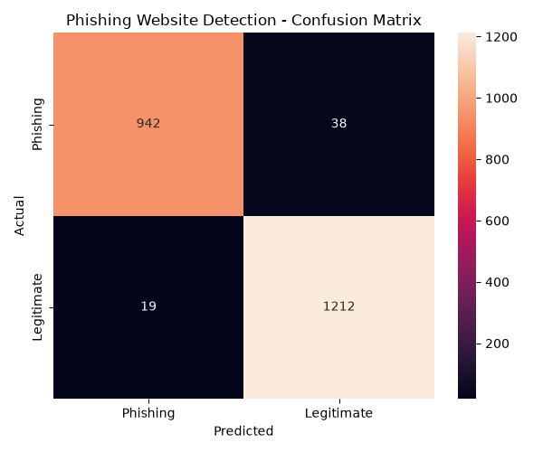

# Machine Learning-Based Phishing Website Detection

A machine learning project that detects whether a website is likely to be phishing or legitimate using URL and website-related features.

## Project Overview

Phishing websites are designed to trick users into providing sensitive information such as usernames, passwords, and financial details.

This project uses machine learning to classify websites based on 30 features related to their URLs and website characteristics.

A Random Forest Classifier is trained on the Phishing Websites dataset and evaluated using a separate testing dataset.

## Machine Learning Workflow

Dataset
↓
Data Preprocessing
↓
Feature Selection
↓
Train-Test Split
↓
Random Forest Classifier
↓
Prediction
↓
Model Evaluation

## Dataset

The project uses the **Phishing Websites dataset** from the UCI Machine Learning Repository.

Dataset size:

- 11,055 website records
- 30 input features
- 1 target variable
- No missing values

The dataset contains features related to URL structure, HTTPS usage, redirects, domain information, web traffic, page rank, and other website characteristics.

## Technologies Used

- Python
- Pandas
- NumPy
- Scikit-learn
- Matplotlib
- Seaborn
- Git & GitHub

## Machine Learning Algorithm

### Random Forest Classifier

Random Forest is an ensemble machine learning algorithm that combines multiple decision trees to make predictions.

In this project:

- Number of trees: 100
- Test size: 20%
- Random state: 42
- Stratified train-test split

## Model Results

The model achieved approximately:

**97.42% Accuracy**

### Classification Report

| Class | Precision | Recall | F1-Score |
|------|-----------|--------|----------|
| -1 | 0.98 | 0.96 | 0.97 |
| 1 | 0.97 | 0.98 | 0.98 |

## Confusion Matrix

The confusion matrix shows the number of correctly and incorrectly classified websites.



## Project Structure

```text
Phishing-Website-Detection/
│
├── data/
│   ├── dataset.csv
│   └── Training Dataset.arff
│
├── results/
│   └── confusion_matrix.png
│
├── src/
│
├── .gitignore
├── main.py
└── README.md